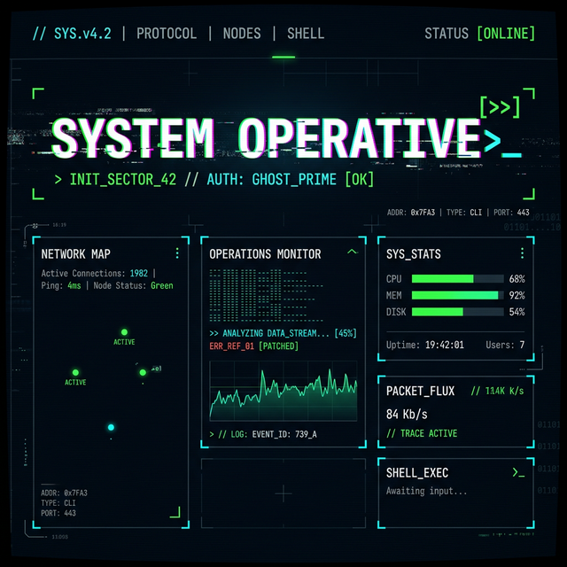

<p align="center">
  
</p>

<h1 align="center">⚡ Terminal Cyberpunk Design Skill</h1>

<p align="center">
  <strong>Transform any web interface into a sci-fi hacker terminal experience</strong>
</p>

<p align="center">
  <a href="#-features"></a>
  <a href="#-installation"></a>
  <a href="LICENSE"></a>
  <a href="#-technologies"></a>
</p>

<p align="center">
  <sub>A design system skill for AI coding assistants that generates memorable, non-generic dark interfaces<br>inspired by Blade Runner, CRT phosphor monitors, and military-grade ops centers.</sub>
</p>

---

## 🔮 What Is This?

**Terminal Cyberpunk Design** is a skill (reusable instruction set) for AI coding assistants like **Claude Code**. When activated, it guides the AI to generate web interfaces with a distinctive **terminal/CLI + cyberpunk hacker aesthetic** — far beyond a generic dark theme with monospace fonts.

Every interface generated with this skill features:

- 🖥️ **CRT-inspired atmospheres** — Grid HUD backgrounds, noise textures, scanlines, radial glows
- 🔤 **Typography with character** — Departure Mono, VT323, Share Tech Mono, Space Grotesk, Orbitron
- 🎨 **Syntax-highlighting color systems** — Semantic palettes that emulate code editor themes
- ✨ **Signature decorative elements** — Corner brackets, data annotations, typing indicators, ASCII art
- 🏗️ **Asymmetric layouts** — Grids that break convention with overlapping elements and diagonal sections
- 🎬 **Orchestrated animations** — Staggered reveals, glitch effects, typing simulations, scroll-triggered transitions

## 🚀 Features

| Feature | Description |
|---------|-------------|
| **5 Terminal Archetypes** | Military ops center, Hacker underground, Corporate sci-fi, Retro phosphor, Neural interface |
| **6 Accent Palettes** | Phosphor Green, Cyan Protocol, Amber Terminal, Crimson Alert, Violet Synthwave, Arctic Mint |
| **Complete Component Library** | Cards, tables, log panels, navigation, stats, CTAs, inputs — all cyberpunk-styled |
| **Design Tokens System** | CSS custom properties for backgrounds, borders, typography, spacing, and animations |
| **Typography Guide** | Curated font pairings with specific roles (display, body, hero, retro, technical) |
| **Working Example** | Full landing page (1000+ lines) demonstrating every principle in action |

## 📦 Installation

### Claude Code (Recommended)

Clone this repository into your project's `.agents/skills/` directory:

```bash
# Navigate to your project root
cd your-project

# Create the skills directory if it doesn't exist
mkdir -p .agents/skills

# Clone the skill
git clone https://github.com/artur282/terminal-cyberpunk-design.git .agents/skills/terminal-cyberpunk-design
```

### Manual Installation

1. Download or clone this repository
2. Copy the `.agents/skills/terminal-cyberpunk-design/` folder into your project's `.agents/skills/` directory
3. The skill will be automatically detected by Claude Code

## 🎯 Usage

Once installed, the skill triggers automatically when you ask your AI assistant to build interfaces with cyberpunk, terminal, or hacker aesthetics. Example prompts:

```
> Build me a trading dashboard with a hacker terminal aesthetic
> Create a landing page with cyberpunk design, dark mode extremo
> Design a monitoring panel that looks like a sci-fi ops center
> Make an admin panel with CLI aesthetic and neon accents
```

### Trigger Keywords

The skill activates on these contexts:

- `"dark mode extremo"`, `"estilo terminal"`, `"estética hacker"`
- `"cyberpunk"`, `"retro-computing"`, `"CLI aesthetic"`
- `"dev tools style"`, `"monospace design"`
- Any request for premium dark interfaces with neon accents

## 📁 Project Structure

```
terminal-cyberpunk-design/
├── SKILL.md                          # Main skill definition & instructions
├── examples/
│   └── landing-page.html             # Complete working example (1000+ lines)
└── references/
    ├── design-tokens.md              # CSS variables, textures, animations
    ├── components.md                 # Cards, tables, logs, nav components
    └── typography.md                 # Font pairings & text conventions
```

### File Reference

| File | Purpose | When to Read |
|------|---------|-------------|
| `SKILL.md` | Core design principles, visual pillars, anti-patterns | Always — entry point |
| `references/design-tokens.md` | CSS custom properties, background textures, keyframes | When starting any new interface |
| `references/components.md` | Pre-built component patterns (cards, tables, logs, nav) | When implementing UI components |
| `references/typography.md` | Font selection guide, text conventions, display styles | When configuring typography |
| `examples/landing-page.html` | Live reference implementation with all principles applied | As inspiration or starting point |

## 🛠️ Technologies

This skill generates interfaces using:

- **HTML5** — Semantic structure
- **CSS3** — Custom properties, Grid, animations, `clip-path`, SVG filters
- **Vanilla JavaScript** — IntersectionObserver for scroll animations
- **Google Fonts** — Curated selection of monospace and display typefaces

No frameworks required. No build tools. Pure web standards.

## 🎨 Design Philosophy

> *"This is NOT a dark theme with monospace fonts. It's a visual experience that blends CRT phosphor monitor nostalgia with Blade Runner-level sci-fi interfaces. Every interface must have PERSONALITY — something memorable after closing the tab."*

### The 6 Visual Pillars

1. **Atmosphere** — Never use flat backgrounds. Layer grid patterns, noise textures, scanlines, and radial glows
2. **Typography** — Never use generic fonts. Each typeface serves a purpose (display, body, hero, retro)
3. **Decorative Elements** — Corner brackets, data annotations, line numbers, interference artifacts
4. **Color System** — Syntax-highlighting inspired semantic colors, not just green-on-black
5. **Layout** — Asymmetric grids, overlapping elements, diagonal sections, generous spacing
6. **Animation** — Orchestrated reveals, glitch effects, typing simulations — never generic fadeIn

### Anti-Patterns (What NOT to Do)

❌ Flat `#000000` backgrounds without texture  
❌ Generic fonts (Inter, Roboto, Arial)  
❌ Only matrix green `#00FF41` as accent  
❌ Symmetric 3-column grids  
❌ Identical cards with only text changes  
❌ Generic `fadeIn` / `slideUp` animations  

## 🤝 Contributing

Contributions are welcome! Please read the [Contributing Guide](CONTRIBUTING.md) for details on how to submit pull requests, report issues, and suggest improvements.

### Quick Start for Contributors

1. Fork the repository
2. Create your feature branch (`git checkout -b feature/amazing-component`)
3. Commit your changes (`git commit -m 'Add amazing component'`)
4. Push to the branch (`git push origin feature/amazing-component`)
5. Open a Pull Request

## 📄 License

This project is licensed under the MIT License — see the [LICENSE](LICENSE) file for details.

## 🙏 Acknowledgments

- Inspired by the aesthetics of **Blade Runner**, **Ghost in the Shell**, and **Mr. Robot**
- Typography powered by [Google Fonts](https://fonts.google.com/)
- Built for [Claude Code](https://claude.ai/) by Anthropic

---

<p align="center">
  <sub>Built with 🖤 and phosphor green by <a href="https://github.com/artur282">Artur282</a></sub>
</p>

<p align="center">
  <code>$ echo "SYSTEM_ONLINE" | terminal-cyberpunk-design --activate</code>
</p>
